# FlyCube-Demos
FlyCube Demos

[FlyCube](https://github.com/andrejnau/FlyCube)

A very good High-level graphics api.

Download FlyCude src and copy to 3rdparty.

## 01 - triangle

## 02 - texture & sampler

> model & texture is under `3rdparty/FlyCube/assets`

## 03 - MultiPass renderer

## 04 - Compute shader

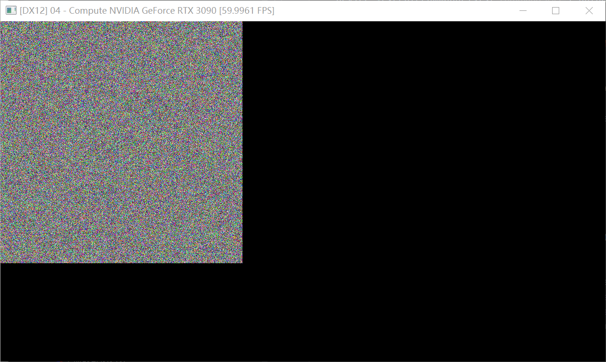

## 05 - DXR

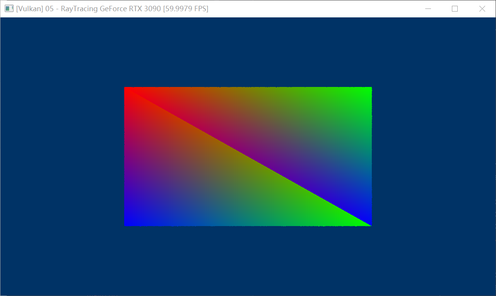

## 06 - Meshshader

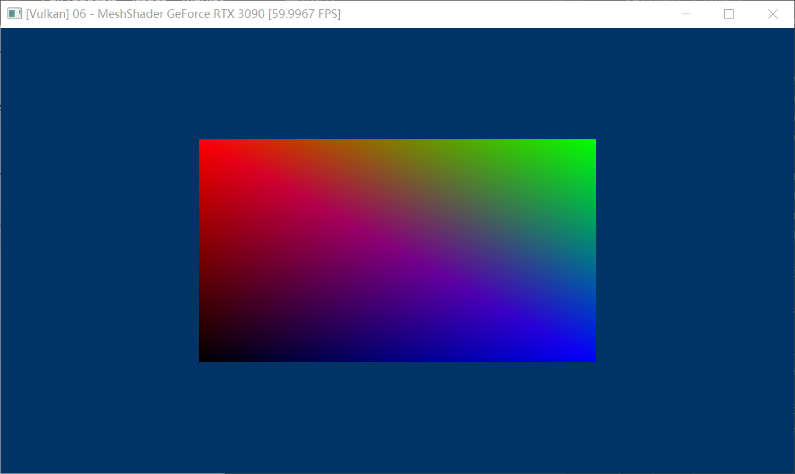

## 07 - VariableRateShading

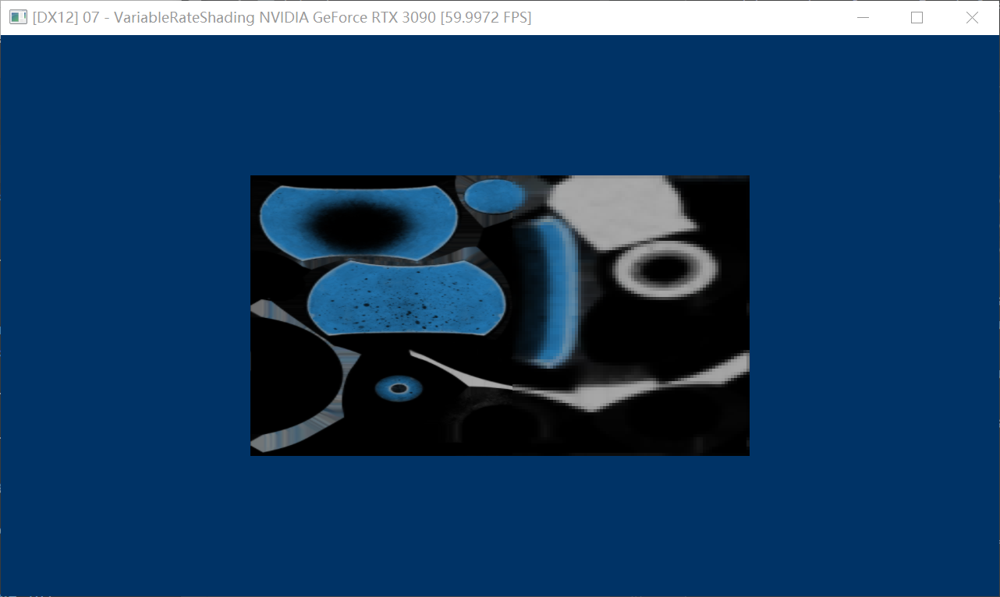

> **left**:  ShadingRate::k1x1
> 
> **right**: ShadingRate::k4x4

## 08 - ImGui

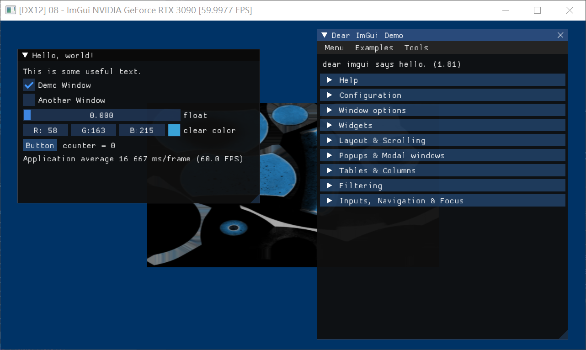

## 09 - DispatchIndirect
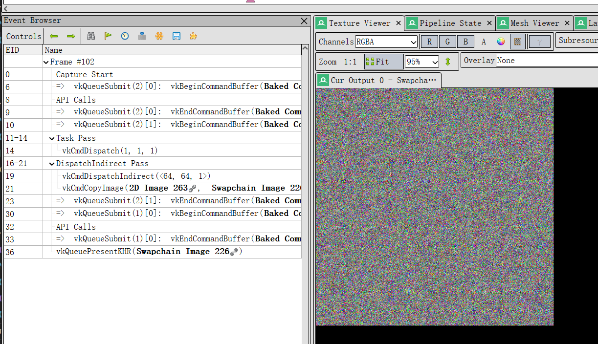

## 10 - DrawIndirect
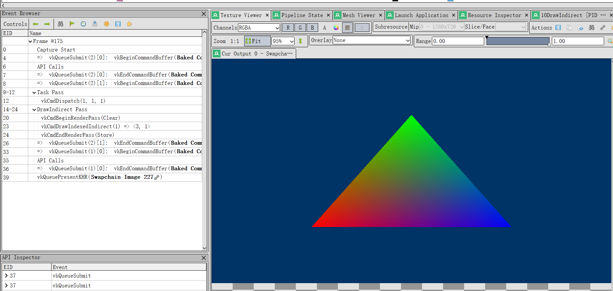

## 11 - MiniPathTracer

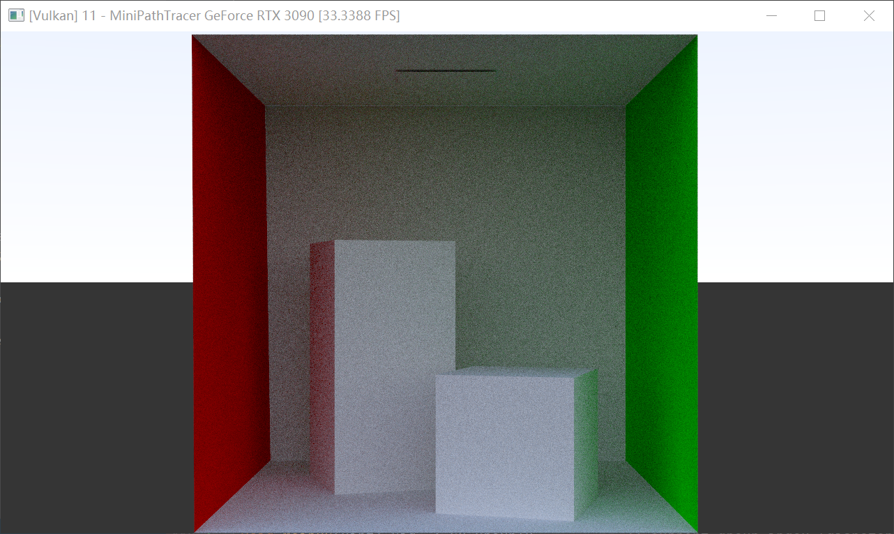

> A mini pathtracer using CS with RayQuery(inline raytracing)

## 13 - ComputeParticles

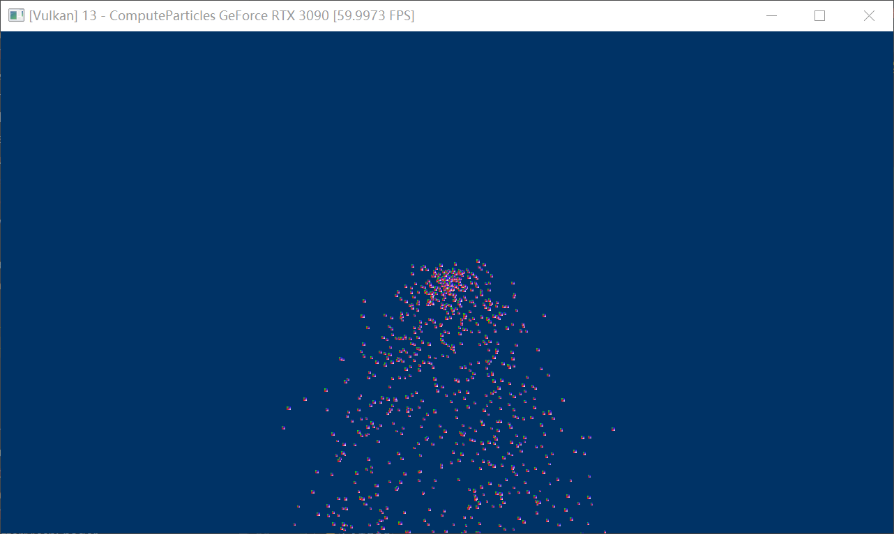

## 14 - PureCSPathTracer

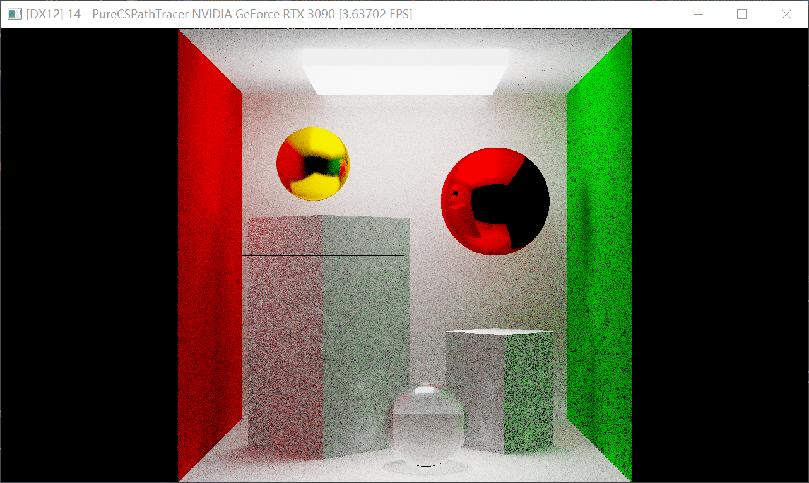

## 16 - RayMarching

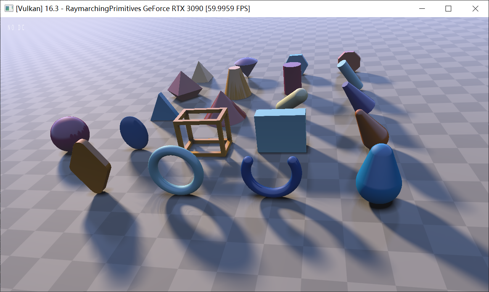

## 17 - VolumeTexture

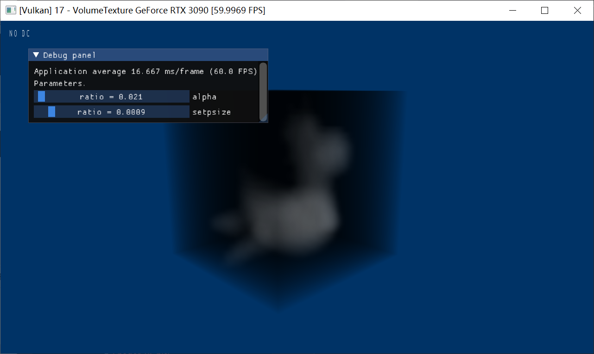

## 17.2 - Volume with noise & gamma

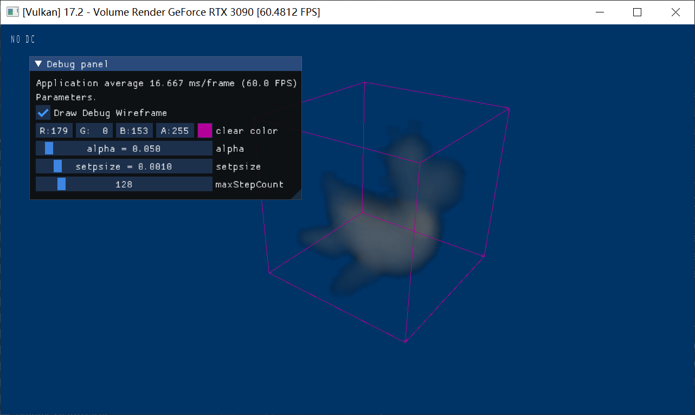

## 18 - Font rendering using IMGUI

## 18.2 - Fontstash

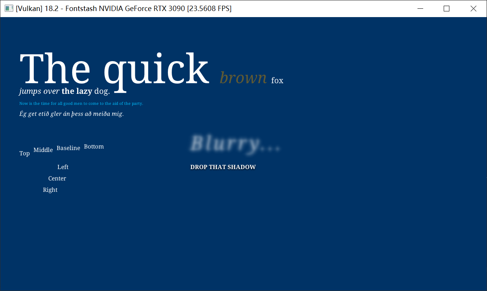

## 19 - CS Skinning

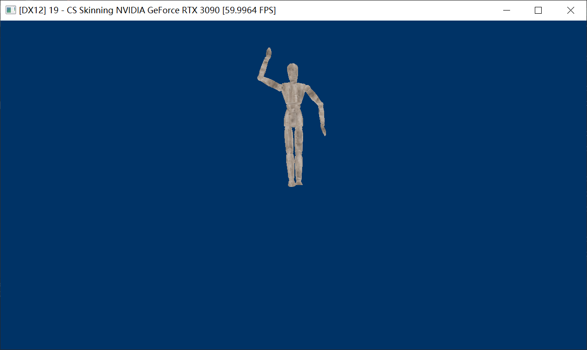
