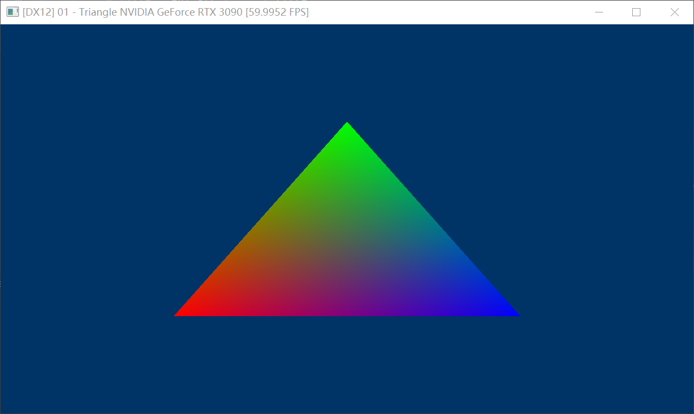
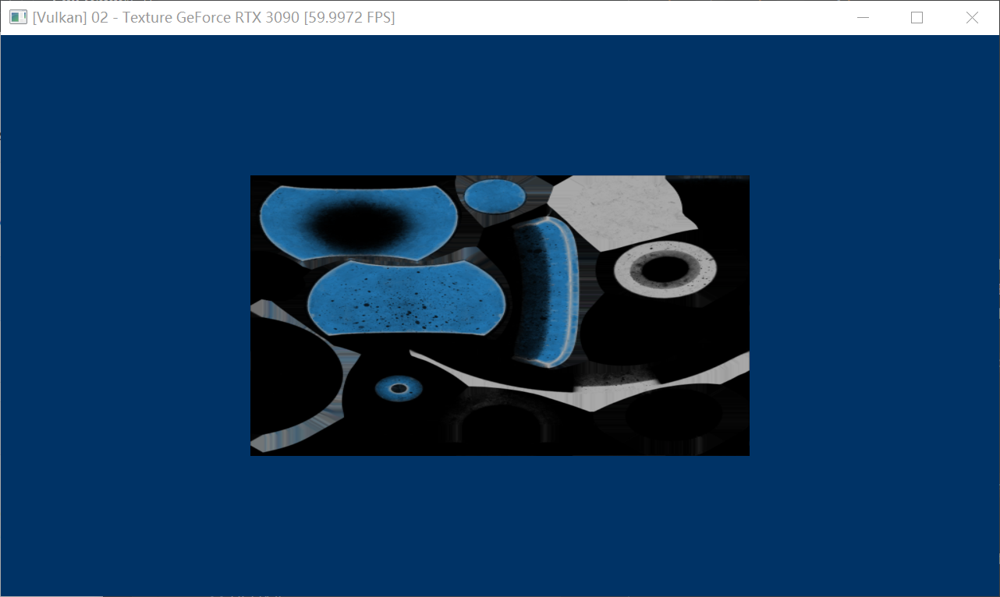
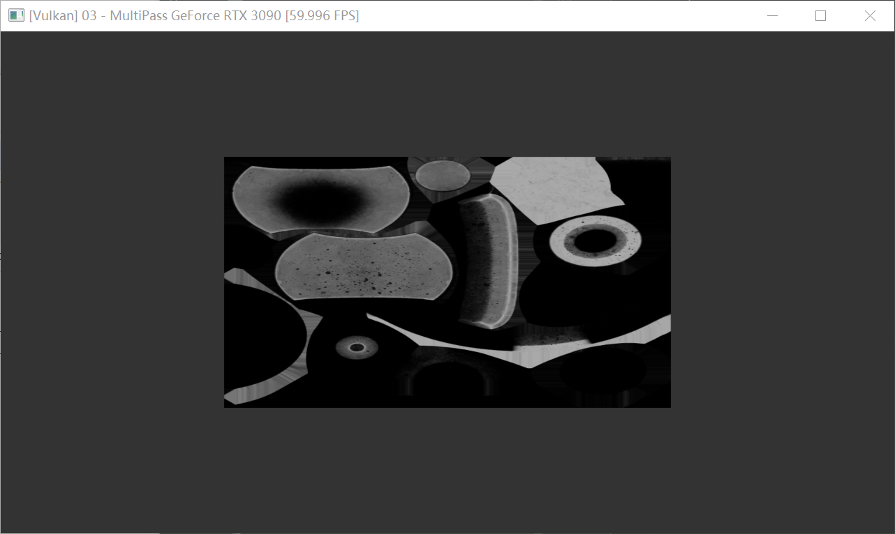

# FlyCube-Demos
FlyCube Demos

[FlyCube](https://github.com/andrejnau/FlyCube)

A very good High-level graphics api.

Download FlyCude src and copy to 3rdparty.

## 01 - triangle

## 02 - texture & sampler

> model & texture is under `3rdparty/FlyCube/assets`

## 03 - MultiPass renderer

